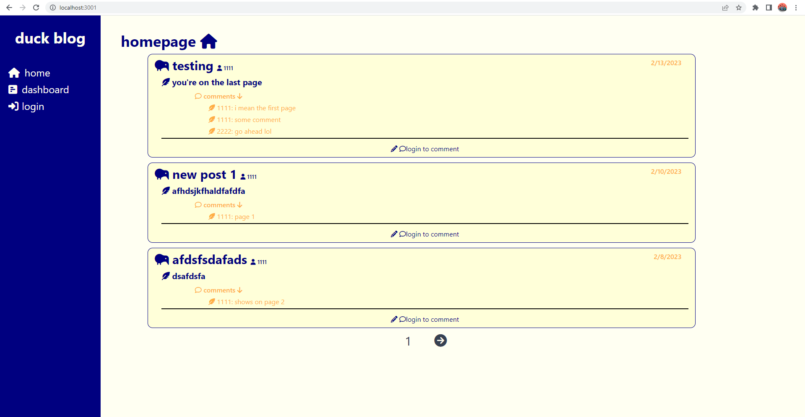

# Duck Blog 🦆

  [](https://opensource.org/licenses/MIT)

  rubber duck debugging is the very real practice of debugging by explaining your code to a nonsentient object, such as a rubber duck 🐥. these rubber ducks sit through hours of your rambling, unmoving and stoic in their guidance. however, what if these ducks were actual people 🤔? in ```duck blog```, users, who shall now be known as ducks, are free to express their thoughts about programming, however advanced or silly their questions may be. other ducks are free to critique your questions in a manner that nonsentient beings never could.
  
  Duck Blog is intended to be a satirical tech blog.

  ### Site Link 💡

  ---

  https://the-duck-blog.herokuapp.com/

  ---

  

  ## Table of Contents 📃

  [Usage 🤔](#usage-🤔)

  [Local Installation 🖥️](#local-installation-🖥️)

  [Contribution Guidelines 🤝](#contribution-guidelines-🤝)

  [Developer Info 🤓](#Developer-info-🤓)


  ## Usage 🤔

  first time ducks should sign up with an account, afterwards, they and returning ducks may login using their account username and password. 
  
  using the left navbar, ducks may navigate home, to their dashboard, or logout. the home page displays the most recent posts and comments made on the duck blog 🏠. the dashboard will display a duck's posts, and here they can edit, delete, or create posts of their own 💬. a next and previous page button is located on the bottom of the page, for ducks to navigate between older and newer posts respectively.

  ducks can browse the home page without an account, but you should make one because it's funny 🥲.

  ## Local Installation 🖥️

  To run this application locally, first clone this repository.

  Then, install the necessary dependencies.

      npm i

  Add a .env file in the root directory with the db name and your credentials.

    DB_NAME='tech_blog_db'
    DB_USER=<your-db-username>
    DB_PASSWORD=<your-db-password>

  Navigate to this repository's root directory and run the following to start the application.

    npm run start

  Your server will be hosted at ```http://localhost:3001```.

  Note: This application utilizes a MySQL database. You will need to install MySQL to run this application locally.


  ## Contribution Guidelines 🤝

  This web application is a solo project. For any inquiries about project collaboration, or any business inquiries, please contact me using my information below!

  ## Developer Info 🤓

  Brandon Ly 🫠 : [Github](https://github.com/brandonkylely) & [LinkedIn](https://www.linkedin.com/in/brandon-ly-7300b1205/) & [Email](mailto:brandonkly@ucla.edu)
  